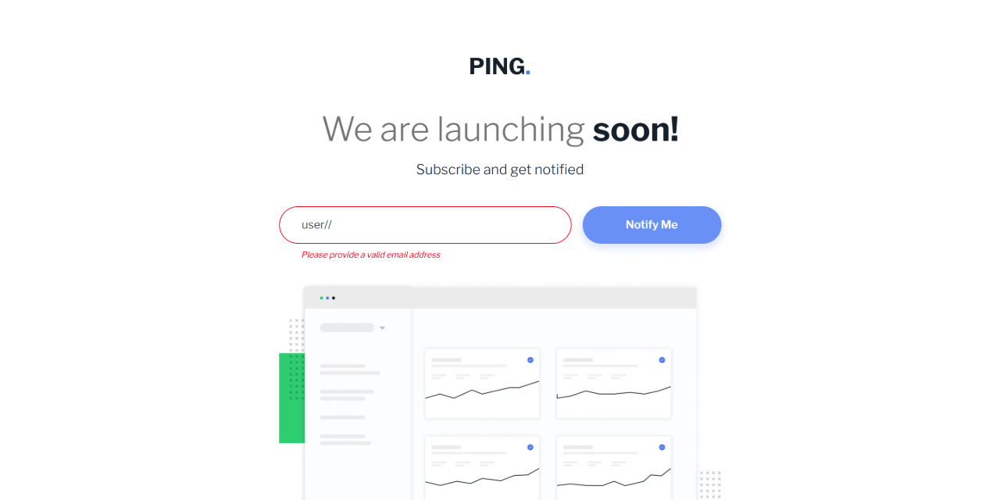
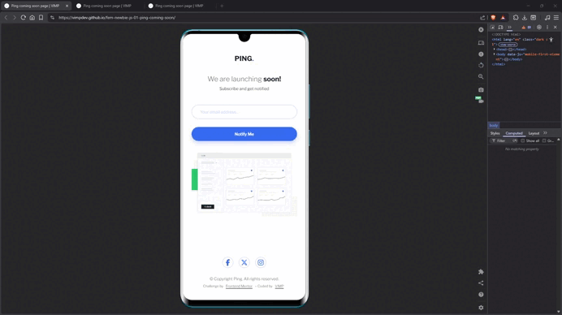

# 🚀 Ping coming soon page




Responsive "coming soon" page with accessible form validation and success feedback using native browser APIs.

This is a solution to the [Ping coming soon page challenge on Frontend Mentor](https://www.frontendmentor.io/challenges/ping-single-column-coming-soon-page-5cadd051fec04111f7b848da).

---

## 🔗 Links

- 🌎 [Live site](https://vimpdev.github.io/fem-newbie-js-01-ping-coming-soon/)
- 📌 [Frontend Mentor solution](https://www.frontendmentor.io/solutions/ping-coming-soon-page-accessible-validation-constraint-api-uVs5_8tCHx)

---

## 🎬 Demo



---

## 📸 Screenshots

### 📱 Mobile
| Default | Error | Success |
| --- | --- | --- |
|  |  |  |

### 📲 Tablet
| Default | Error | Success |
| --- | --- | --- |
|  |  |  |

### 🖥️ Desktop

| Default | Focus state |
| --- | --- |
|  |  |

| Error | Success |
| --- | --- |
|  |  |

---

## 🧠 Key Features

- Semantic and accessible HTML structure
- Responsive layout (mobile-first)
- Email validation using **Constraint Validation API**
- Lazy validation pattern (no aggressive feedback while typing)
- Accessible error handling (`aria-invalid`, `aria-live`)
- Native `<dialog>` for success feedback
- Focus management after interactions

---

## 🛠️ Built with

- Semantic HTML5
- CSS (Custom properties + Layers)
- Flexbox & responsive design
- Vanilla JavaScript (no frameworks)
- Native browser validation (`checkValidity`, `validity`)

---

## 💡 What I learned

- How to use the **Constraint Validation API** instead of relying only on regex
- How to implement **lazy validation** (validate on blur + improve on input)
- Managing UI state with a simple flag (`hasError`)
- Handling focus correctly after submit and dialog interactions
- Structuring CSS using `@layer` for scalability

Example:

```js
if (!emailInput.checkValidity()) {
  if (emailInput.validity.valueMissing) {
    message = 'Whoops! It looks like you forgot to add your email';
  } else {
    message = 'Please provide a valid email address';
  }
}
```

---

## 🤖 AI Collaboration

AI tools were used during development to:

- Review validation logic and UX decisions
- Improve accessibility handling (form states, ARIA)
- Refine code structure and naming
- Explore patterns like lazy validation

They were mainly useful for quick feedback, clarification, and iteration.

---

## 👩‍💻 Author

- Frontend Mentor – [@vimpdev](https://www.frontendmentor.io/profile/vimpdev)

---